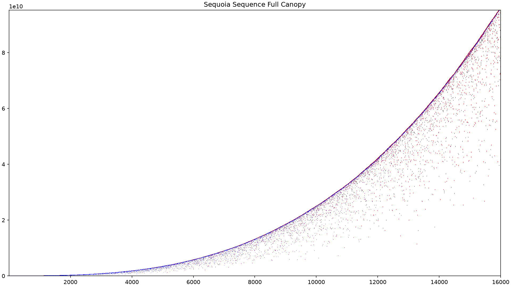
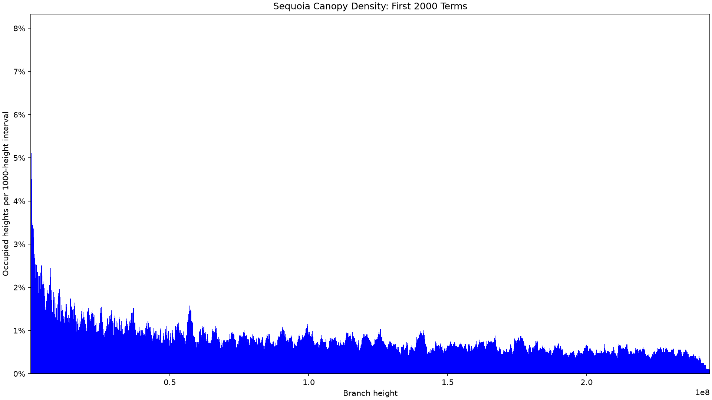
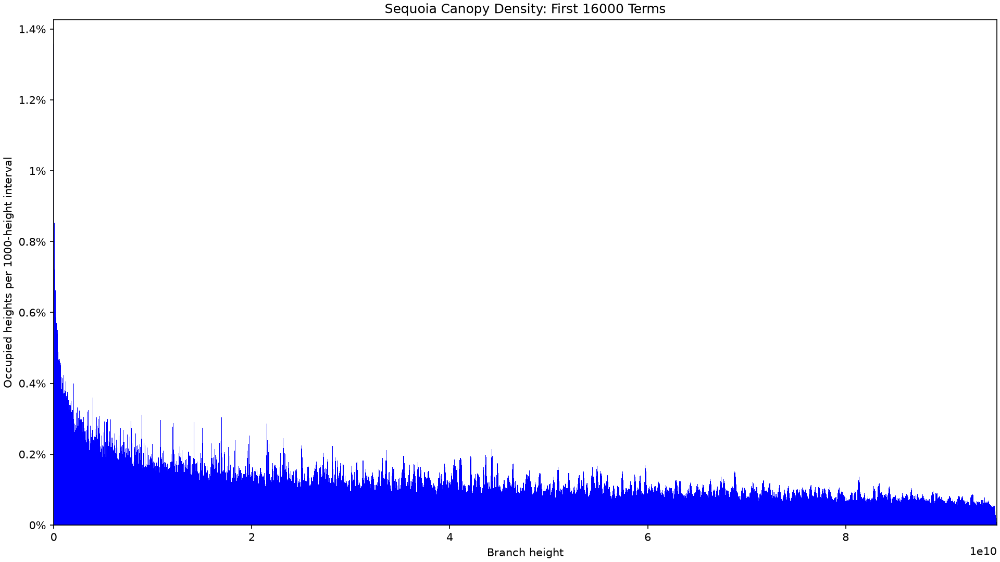
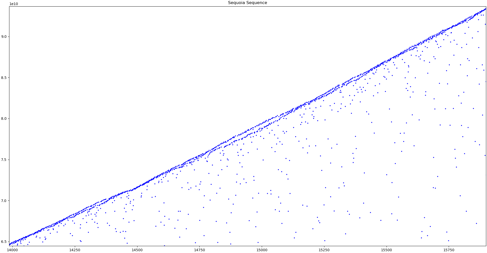

# Plotting

These scripts read the sequoia sequence from:

```text
results/sequence.txt
```

Each input line is expected to have the format:

```text
<index> <term>
```

Run each script from the repository root.

Each plotting script can either open an interactive window or save directly to
an image file. To save a plot, pass `--output <path>`. Parent directories are
created automatically. Saved images use a 16:9 1920x1080 canvas.

## Direct Scatter Plot

Plots the sequence terms directly as `(n, a(n))`.

```bash
python3 scripts/plotting/direct_scatter_plot.py
```


By default, both axes are linear. To use a log-log view:

```bash
python3 scripts/plotting/direct_scatter_plot.py --log
```


To save either version:

```bash
python3 scripts/plotting/direct_scatter_plot.py --output docs/images/direct_scatter.png
python3 scripts/plotting/direct_scatter_plot.py --log --output docs/images/direct_scatter_log.png
```

## Full Canopy Scatter Plot

Plots the sequence terms `(n, a(n))` in blue and every additional branch height
`(n, a(n) + kn)`, for `1 <= k < n`, in red.

```bash
python3 scripts/plotting/full_canopy_scatter.py
```



The plot is rasterized at the output resolution so the complete set of branch
points can be displayed without retaining every marker in memory. Every red
branch point and blue sequence term is drawn as an individual pixel, with blue
pixels written last so the sequence terms remain visible.

The script also supports logarithmic axes and saving to a file:

```bash
python3 scripts/plotting/full_canopy_scatter.py --log
python3 scripts/plotting/full_canopy_scatter.py --output docs/images/full_canopy_scatter.png
```

## Normalized Scatter Plot

Plots residuals after subtracting a conjectural growth term `a(n) - c * n^3 / log(n)`

```bash
python3 scripts/plotting/normalized_scatter_plot.py
```


```text
c = 0.2255
```

To provide a different constant:

```bash
python3 scripts/plotting/normalized_scatter_plot.py 0.224
```

To save the plot:

```bash
python3 scripts/plotting/normalized_scatter_plot.py --output docs/images/normalized_scatter.png
```

The y-axis window is set using only terms near the previous running
maximum. All residual points are still plotted, but points outside that window
are clipped by the graph bounds.

## Canopy Density

Counts occupied canopy heights in the intervals `1–1000`, `1001–2000`, and so
on, then plots each count as a percentage of the 1,000 available heights. Pass
the number of sequence terms to include as an optional argument.

```bash
python3 scripts/plotting/canopy_density.py 2000
python3 scripts/plotting/canopy_density.py 16000
```





To save the plots:

```bash
python3 scripts/plotting/canopy_density.py 2000 --output docs/images/canopy_density_2000.png
python3 scripts/plotting/canopy_density.py 16000 --output docs/images/canopy_density_16000.png
```

When there are more intervals than horizontal output pixels, adjacent interval
percentages are averaged into display bars. Every canopy point is still counted
in its exact 1,000-height interval before this display-only aggregation.

## Drop Distribution

For each term, this tracks the largest previous term and records 
`100 * a(n) / previous_max`

```bash
python3 scripts/plotting/drop_distribution.py
```


Values below 100% are drops from the previous maximum. Values above 100% are new
records.

The plot is a histogram with:

- x-axis range from 0% to 200%
- 1% bucket width
- y-axis measured as percent of sequence terms
- linear y-axis by default

The dashed vertical line marks 100%.

To use a logarithmic y-axis:

```bash
python3 scripts/plotting/drop_distribution.py --log
```

To save the plot:

```bash
python3 scripts/plotting/drop_distribution.py --output docs/images/drop_distribution.png
```

## Observations

The sequence's "frontier" terms oddly split into two distinct bands at various
points.


