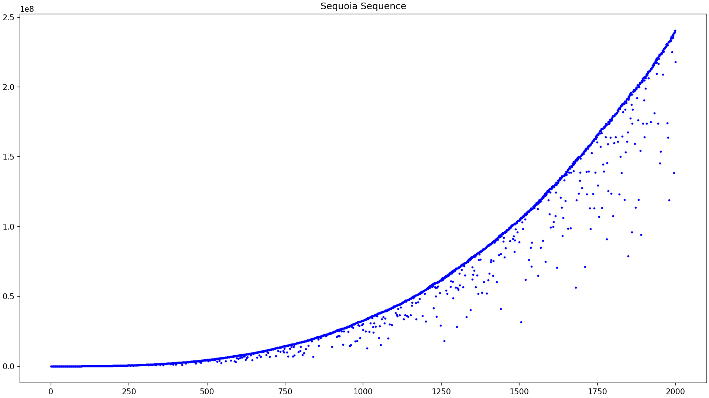
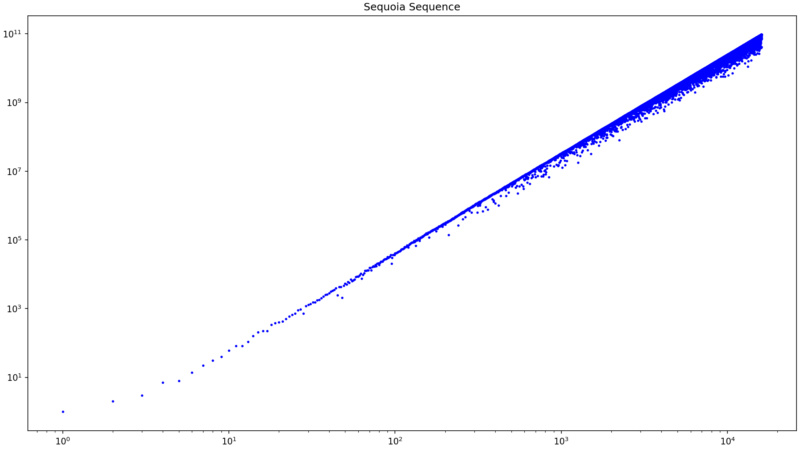
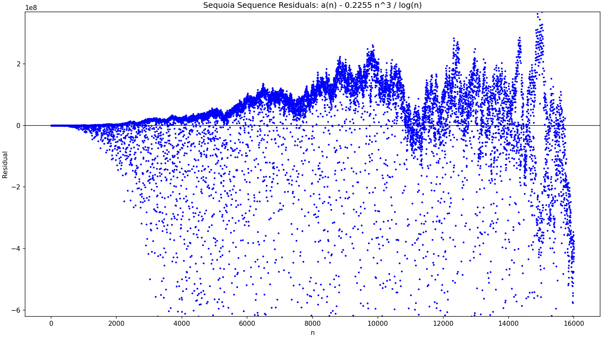
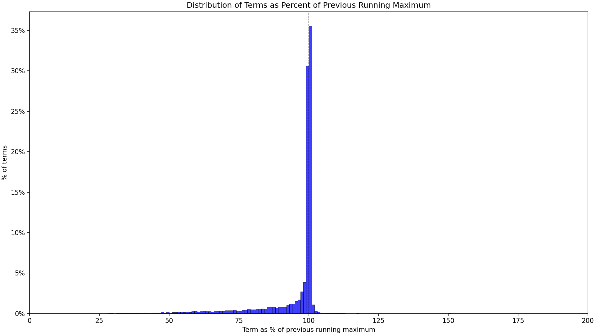

# Plotting Scripts

These scripts read the sequoia sequence from:

```text
results/sequence.txt
```

Each input line is expected to have the format:

```text
<index> <term>
```

Run each script from the repository root.

Each plotting script can either open an interactive window or save directly to
an image file. To save a plot, pass `--output <path>`. Parent directories are
created automatically. Saved images use a 16:9 1920x1080 canvas.

## Direct Scatter Plot

Plots the sequence terms directly as `(n, a(n))`.

```bash
python3 scripts/plotting/direct_scatter_plot.py
```



By default, both axes are linear. To use a log-log view:

```bash
python3 scripts/plotting/direct_scatter_plot.py --log
```



To save either version:

```bash
python3 scripts/plotting/direct_scatter_plot.py --output docs/images/direct_scatter.png
python3 scripts/plotting/direct_scatter_plot.py --log --output docs/images/direct_scatter_log.png
```

## Normalized Scatter Plot

Plots residuals after subtracting a conjectural growth term `a(n) - c * n^3 / log(n)`

```bash
python3 scripts/plotting/normalized_scatter_plot.py
```


It would be nice to know why this normalization is so nicely wavy.

The default constant is:

```text
c = 0.229
```

To provide a different constant:

```bash
python3 scripts/plotting/normalized_scatter_plot.py 0.225
```

To save the plot:

```bash
python3 scripts/plotting/normalized_scatter_plot.py --output docs/images/normalized_scatter.png
```

The y-axis window is set using only terms within 1% of the previous running
maximum. All residual points are still plotted, but points outside that window
are clipped by the graph bounds.

## Drop Distribution

For each term, this tracks the largest previous term and records 
`100 * a(n) / previous_max`

```bash
python3 scripts/plotting/drop_distribution.py
```



Values below 100% are drops from the previous maximum. Values above 100% are new
records.

The plot is a histogram with:

- x-axis range from 0% to 200%
- 1% bucket width
- y-axis measured as percent of sequence terms
- linear y-axis by default

The dashed vertical line marks 100%.

To use a logarithmic y-axis:

```bash
python3 scripts/plotting/drop_distribution.py --log
```

To save the plot:

```bash
python3 scripts/plotting/drop_distribution.py --output docs/images/drop_distribution.png
```

